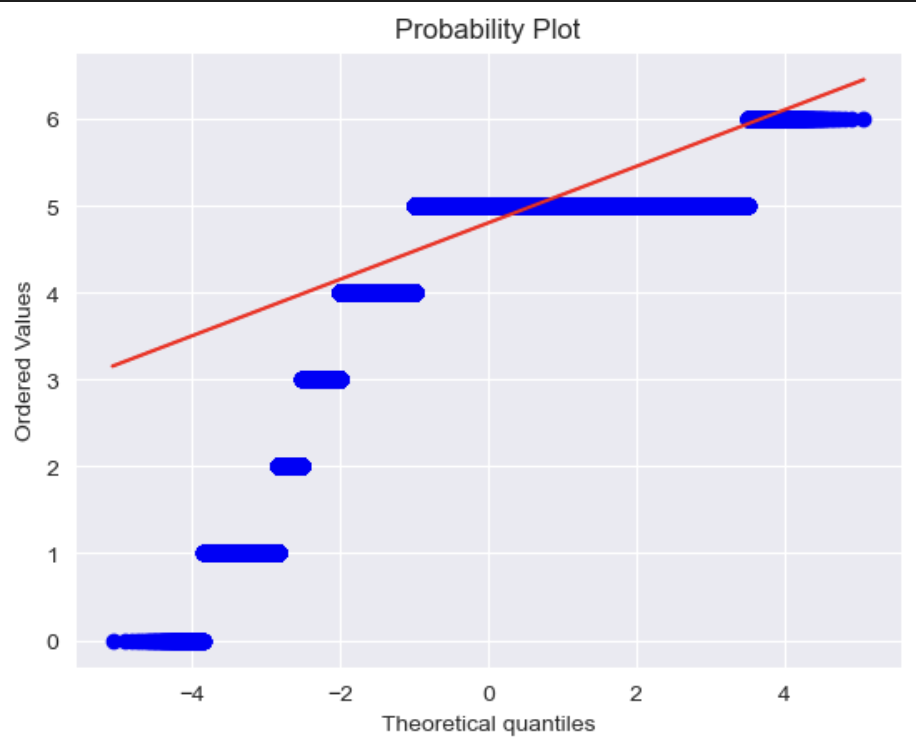
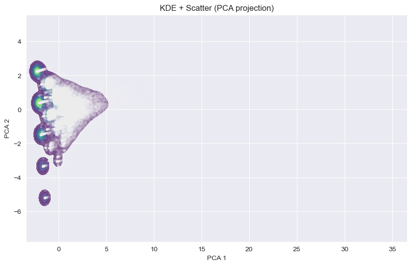
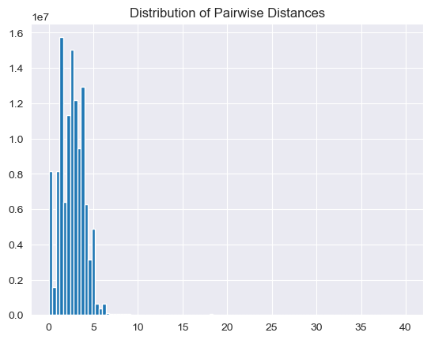
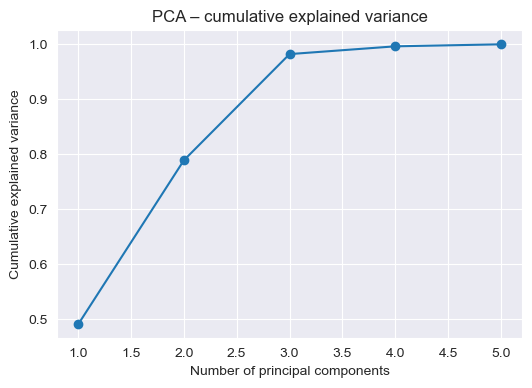
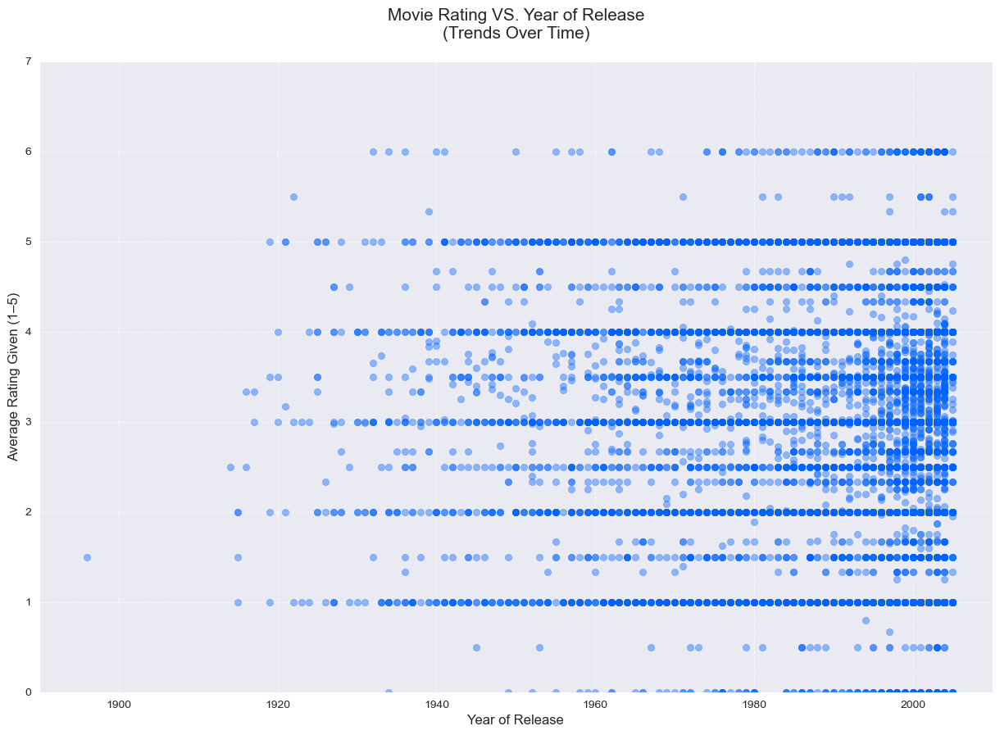
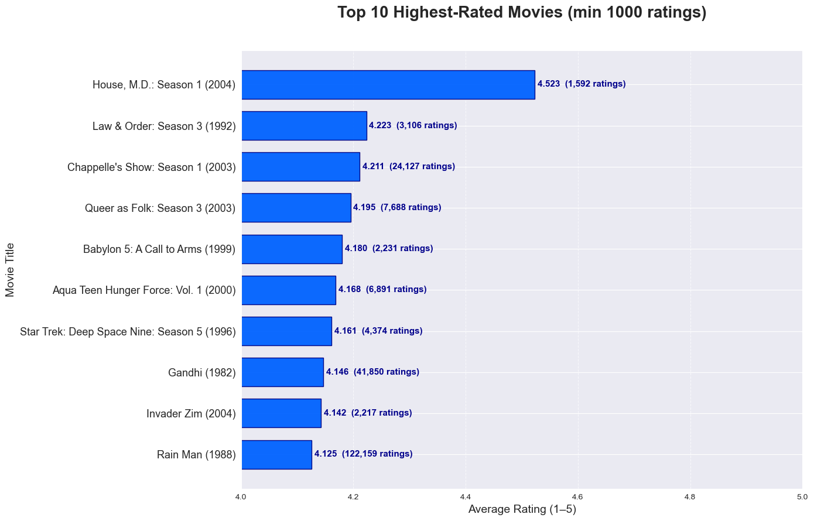
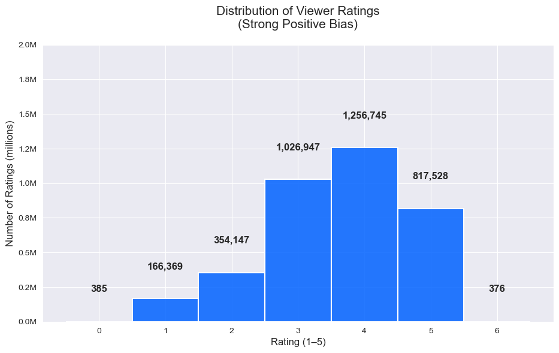

# ROM_AD_Project_321481

**Team Members**  
Ryder Wood — Captain: 321481  
Marco Malliani: 324971  
Giacomo Mazzarella: 321931  

## 1. Introduction
The goal of this project is to identify user and movie relationships using clustering models. We start by calculating as many missing values as possible and removing unusable data. Once our data is clean, we analyze movie-level and user-level statistics separately and apply unsupervised clustering methods to uncover patterns in viewer behavior and movie performance.

Our broader motivation is to understand how this dataset could support future recommendation systems.

## 2. Methods
### 2.1 Environment & Tools
- Python 3.12  
- Libraries: pandas, numpy, matplotlib, seaborn, scikit-learn, datetime, scipy, sqlite3  
- Install: `pip install -r requirements.txt`

Dataset: `viewer_interactions.db`  link: https://my.luiss.it/pluginfile.php/87173/mod_folder/content/0/viewer_interactions.db?forcedownload=1
Viewer tool: https://inloop.github.io/sqlite-viewer/

### 2.2 Features Used
**Movie features:**  
`movie_total_ratings`, `movie_avg_rating`, `movie_std_rating`, `movie_min_rating`, `movie_max_rating`

**User features:**  
`user_total_ratings`, `activity_days`

**User Features Full**
`user_total_ratings`, `activity_days`, `user_avg_rating`, `user_std_rating`, `user_min_rating`, `user_max_rating`, `unique_movies`

### 2.3 Preprocessing
Recovered missing values, merged tables, dropped irrecoverable rows, scaled all numeric features.

### 2.4 Helper Functions
(add_new_df, sync_dataframe, search_by_parameter, manual_std, convert_string_to_date, elbow_method, compute_silhouette_score, inspect_movie_cluster, plot_clusters_pca_2d, plot_dbscan_pca_2d)

### 2.5 Models Used
K-Means++, Agglomerative, GMM, DBSCAN

## 3. Experimental Design
### 3.1 EDA Experiment
Purpose: understand data structure.  
Findings: large missing values; most recoverable.

### 3.2 Variance & Correlation Experiment
Purpose: identify informative features.  
Findings: selected two user features; removed correlated variables.

### 3.3 Normality Test

Purpose: verify GMM assumptions.  
Findings: data not Gaussian therefore GMM invalid.

### 3.4 KDE Experiment

Purpose: detect density regions.  
Findings: movies form one blob; users form curved shape therefore K-means is limited. DBSCAN might show fake s-score

### 3.5 KNN Statistics
Users: high density variation inclines DBSCAN is possible.  
Movies: uniform meaning that K-means is more effective.

### 3.6 Pairwise Distance Distribution

Findings: curse of dimensionality limits distance-based clustering.

### 3.7 Hopkins Statistic
bopth users and movies: H > 0.9 therefore it technically has strong clustering tendency.

### 3.8 PCA Explained Variance

Explained variance ratio: [0.492 0.298 0.193 0.014 0.003]
Cumulative: [0.492 0.79 0.984 0.997 1. ]
The cumulative varience ratio shows us that at 3 dimensions majority of out data is showcased (0.984 = 98.4%). The reason this is important because it means for algorithms like K-means it will be able to handle this data more easily.

### 3.9 Modeling Experiments
Experiment 1: Optimal Cluster Number Determination

Main Purpose: Identify the ideal number of clusters that balances compactness and separation to reveal distinct viewer behaviors (e.g., casual vs. avid raters). Baseline: Default K-Means with k=2 and random initialization (keep constant/Use the same random_state). Evaluation Metric(s): elbow method for compactness, and silhouette score (range -1 to 1) for cluster quality—chosen because it measures both cohesion and separation without requiring labels. Experiment 2: Algorithm Comparison

Experiment 2: Algorithm Comparison

Main Purpose: Compare clustering algorithms to find the most interpretable model for user grouping, assessing robustness to noise and high dimensionality. Baseline: K-Means with default parameters (use of elbow method later to find optimal). Evaluation Metrics: Silhouette score for overall quality

## 4. Results
### 4.1 K-Means++ (Movies)
k = 4  
Cluster descriptions included.  
Silhouette ≈ 0.54

### 4.1.1 K-Means++ (Movies without Outlires) 
Silhouette ≈ 0.52

### 4.2 K-Means++ (Users, full)
Silhouette ≈ 0.32 

### 4.2.1 K-Means++ (Users, partial)
Silhouette ≈ 0.61

### 4.3 DBSCAN
Silhouette ≈ 0.80 on dense core (misleading)

### 4.4 Agglomerative
Silhouette ≈ 0.49

### 4.5 GMM
Silhouette ≈ 0.14 (as expected)

### 4.6 Comparison Table
| Model | Dataset | Silhouette | Strengths | Weaknesses |
|-------|---------|------------|-----------|-------------|
| K-Means++ | Movies | ~0.54 | interpretability | spherical assumption |
| K-Means++ | Users | ~0.32 | simple | elongated shape |
| DBSCAN | Movies | ~0.80* | finds dense cores | discards noise |
| Agglomerative | Movies | ~0.49 | hierarchy | noise-sensitive |
| GMM | Movies | 0.14 | probabilistic | data not normally distributed |

### 4.7 Models Preformance Explained

Performance of DBSCAN:

reasons for it being the best option based on testing.
the KDE map, hopkins statistic and pairwise distribution all indicate that the dataset as a whole does not contain clear cluster structure. (the point density forms a single continuos mass with no seperated peaks) however DBSCAN produces a high silhoutte score by discarding a large part of the data as noise, and cluster only the dense core regions. We launched evaluating test on this sub-set independently where even K-means achives a high silhoutte score (around 0.84) confirming that DBSCAN is not discovering true clusters, but rather exploiting density artifacts in the data.

Why K-Means++ Performed Better Than the Other Models

K-Means++ performed the best overall because of the structure of our data.
In both the user and movie feature spaces, most points heavily overlap and form a single dense mass, rather than several well-separated regions. This type of structure naturally aligns with how K-Means works:
	•	K-Means assumes spherical (round) clusters defined by distance to each centroid.
	•	When the dataset forms one or several dense, rounded clouds of points, K-Means can partition these regions cleanly.
	•	Even though the clusters are not perfectly spherical, the heavy overlap and smooth density gradients allow K-Means++ to find stable boundaries.

In contrast:
	•	DBSCAN struggled because the data does not contain clear low-density gaps; it ended up labeling most points as noise.
	•	Hierarchical clustering was sensitive to noise and produced less coherent groups.
	•	GMM failed because the data is not Gaussian and does not follow elliptical covariance shapes.

Therefore, the dense, overlapping structure of the dataset made K-Means++ the most robust and reliable clustering method among those tested.

### 4.8 Plots

## 5. Conclusions
### Summary
Reconstructed missing data, merged statistics, applied clustering, extracted insights on viewer behavior and movie performance. K-Means++ best for movies; DBSCAN misleading; GMM invalid.

